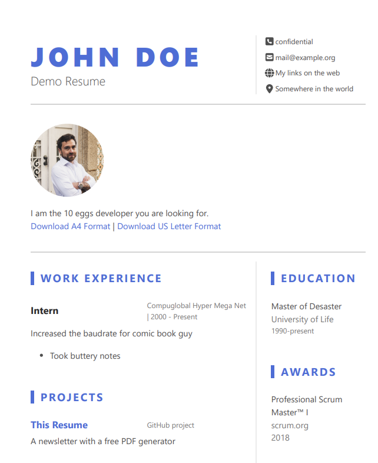

# The resume that builds itself

If you want a good looking resume, look no further.

Just clone that repo, edit `config.toml` and follow the instructions on this blog post to get a nice looking online resume with automated PDFs.

Here is what you need:

- An account on netlify (free)
- An account on pdf.co (free credits available)
- a domain name 

## How it looks

[https://resume-demo.bas.work](https://resume-demo.bas.work)